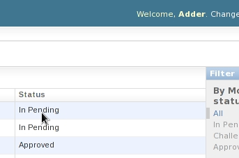
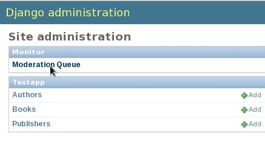
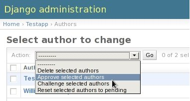

.. _`admin_howto`:

=============================
How to use (for admin-users)
=============================

All moderation activities can be performed from within the admin interface
itself. Following sections describe the process in detail. The figures are
based on an example app, ``TestApp`` with models like ``Author`` and ``Book``.

Who can moderate
==================

Django-monitor creates a moderate permission for each moderated model.
To moderate any object of a model, user need to have permission for that
particular model. The superuser must assign those permissions to the
appropriate users as they would do with other permissions.

What to moderate & from where
===============================

To see and moderate the pending/challenged objects of a particualr model, visit
the change-list page of that model. By default, all existing objects appear
there. For moderated models, we add one more column, ``status`` to the right of
each row. That column, as its name indicates, displays the current moderation
status of each object you see in the list. This helps you to identify the
pending as well as challenged objects. See the figure:

Also, you can filter the objects by ``moderation status`` using the options
provided in the box to the right of change-list. Refer to the figure below:

.. image:: _images/moderation_filter.jpg
   :alt: Filter

You need not regularly visit change-lists of all models to know whether there
are any objects to be moderated. ``Moderation Queue`` is the shortcut for this.
It will summarize the moderation status for all models in one page. In your
admin home page there is a ``Moderation Queue`` change-link under ``Monitor``
app. See the figure:

Clicking on it will lead you to a moderation queue page from where you can see
a nice table listing out the number of pending and challenged objects for each
moderated model. An example figure is given below:

.. image:: _images/moderation_queue.jpg
   :scale: 70
   :alt: Moderation Queue page

Note that the pointer points to the number `2` in the figure. This number
indicates that there are 2 pending ``Author`` objects now. Click on that number
and you will be lead to the ``Author`` change-list where you can see both of the
pending objects. Similarly, you can find pending/challenged objects of any model
from here.

How to moderate
=================

Moderation is performed through 3 special change-list actions. They are,
``Approve selected``, ``Challenge selected`` and ``Reset selected to pending``.
The figure below shows the actions found in ``Author`` changelist:

If the manager selects few objects, chooses the action ``Approve selected`` and
presses ``Go``, those objects will get approved. Similarly, one can challenge 
objects too. Once some objects get challenged, the non-managers may check them
again and make required corrections. After that, they can reset the status to
``In pending`` using the action, ``Reset selected to pending`` so that their
manager gets to verify the entries again.

